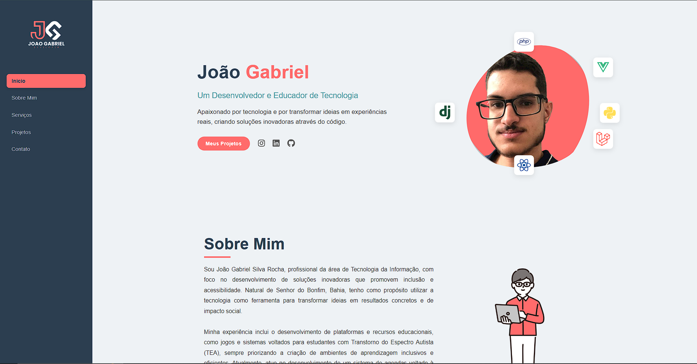
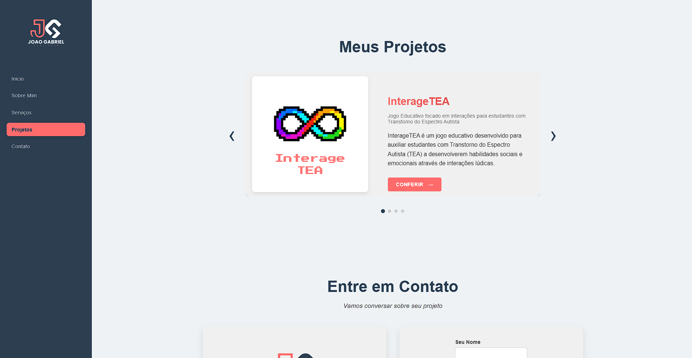
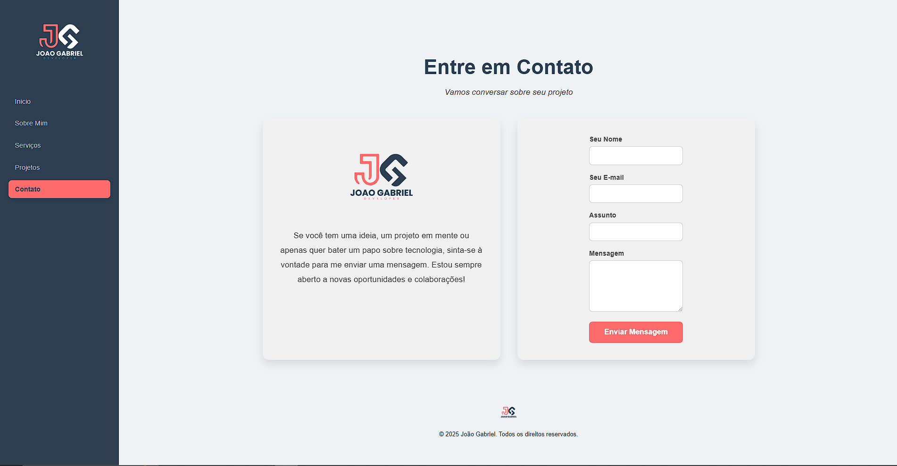

### `README.md`

# Portfólio de João Gabriel

Bem-vindo ao meu portfólio pessoal\! Este projeto foi desenvolvido para apresentar minhas habilidades, projetos e formas de contato.

## ✨ Sobre o Projeto

Este é um portfólio pessoal construído com **Vue.js**, demonstrando minhas competências em desenvolvimento front-end. O objetivo é criar uma experiência de usuário fluida e responsiva, onde os visitantes podem conhecer mais sobre mim, meus serviços e meus projetos.

## 🚀 Tecnologias Utilizadas

  * **Vue.js:** Framework JavaScript progressivo para a construção da interface do usuário.
  * **HTML5 & CSS3:** Para a estruturação e estilização das páginas.
  * **JavaScript (ES6+):** Linguagem de programação para a lógica da aplicação.
  * **FormSubmit:** Serviço de terceiros utilizado para o envio de mensagens do formulário de contato sem a necessidade de um backend.

## 📁 Estrutura do Projeto

A aplicação é organizada em componentes reutilizáveis, seguindo a convenção do Vue.js para uma estrutura limpa e de fácil manutenção:

```
/
├── .vscode/
├── .assets/
├── node_modules/
├── public/
│   └── ...
├── src/
│   ├── components/
│   │   ├── Icon/
│   │   ├── About.vue
│   │   ├── ContactSection.vue
│   │   ├── Footer.vue
│   │   ├── Home.vue
│   │   ├── MainPage.vue
│   │   ├── ProjectsSection.vue
│   │   ├── ServicesSection.vue
│   │   └── SideBar.vue
│   ├── router/
│   │   └── router.js
│   ├── App.vue
│   └── main.js
├── .gitattributes
├── .gitignore
├── index.html
├── LICENSE
├── package.json
├── package-lock.json
├── README.md
├── vite.config.js
└── jsconfig.json
```

## 🖼️ Screenshots

Aqui estão algumas imagens da aplicação em funcionamento:

  * **Página de Inicial**
  
  * **Seção de Projetos:**
  
  * **Seção de Contato:**
  

## 🛠️ Como Executar o Projeto

Para clonar e executar este projeto em sua máquina local, siga estes passos:

1.  **Clone o repositório:**
    ```bash
    git clone https://github.com/jgasrocha/Portifolio.git
    cd Portifolio
    ```
2.  **Instale as dependências:**
    ```bash
    npm install
    ```
3.  **Inicie o servidor de desenvolvimento:**
    ```bash
    npm run dev
    ```
    O portfólio estará acessível em `http://localhost:5173` (ou outra porta especificada).

## 📞 Contato

Fique à vontade para me contatar através do formulário na seção de contato ou pelas redes sociais:

  * **Email:** gabrieldeveloper33@gmail.com
  * **GitHub:** [jgasrocha](https://github.com/jgasrocha)
  * **Instagram** [jgasrocha_dev] (https://www.instagram.com/jgasrocha_dev/)
